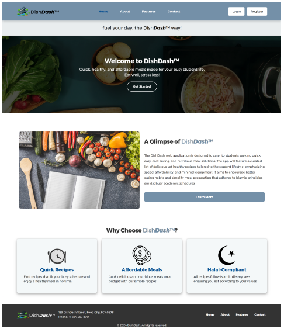
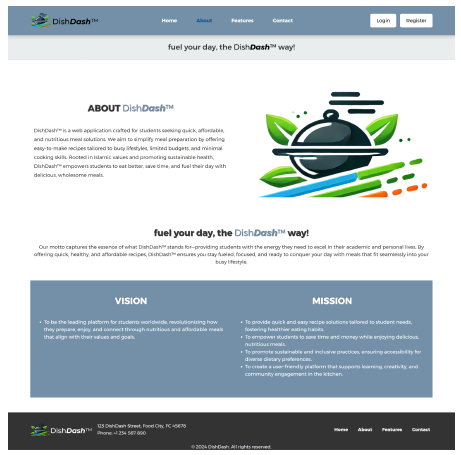
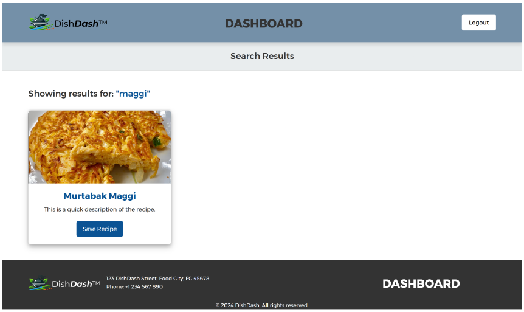
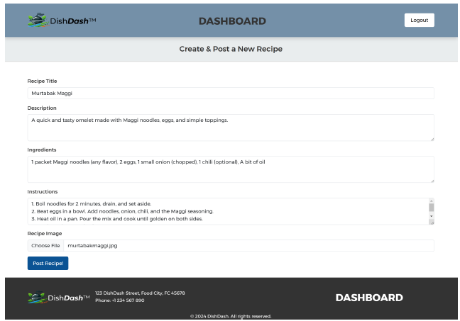

# 🍲 DishDash

> **Web Application Development** > Quick, healthy, and affordable meal solutions tailored for students.

  

## 📖 Overview

**DishDash** is a web-based application designed to cater to students seeking quick, cost-saving, and nutritious meal solutions. The platform addresses the challenges of limited budgets and busy schedules by offering a curated list of recipes that are easy to prepare and adhere to Islamic dietary laws (**Halal-compliant**).

It aligns with **SDG 3 (Good Health and Well-being)** by encouraging better eating habits and minimizing food waste through ingredient-based recipe suggestions.

---

## 💻 App Interface

The interface is designed with a "Convenience-Centric" approach, ensuring a seamless experience across web and mobile devices.

| **Home & Welcome** | **About & Vision** |
|:---:|:---:|
|  |  |
| **Landing Page**<br>Features the motto "Fuel your day, the Dish Dash way!" with quick access to recipe categories and core value propositions. | **Our Mission**<br>Information about the platform's goal to empower students to eat better and save time. |

| **Authentication** | **User Dashboard** |
|:---:|:---:|
|  |  |
| **Secure Access**<br>Robust login and registration pages built with Laravel Jetstream/Fortify for secure user management. | **Personal Hub**<br>The main user area to view recommended recipes, saved favorites, and manage profile settings. |

| **Recipe Discovery** | **Recipe Details** |
|:---:|:---:|
|  |  |
| **Smart Search**<br>Find recipes by ingredients or keywords. Perfect for students trying to cook with what they have in the pantry. | **Comprehensive View**<br>Detailed breakdown of ingredients, step-by-step cooking instructions, and visual guides. |

| **Create & Contribute** | **Edit & Manage** |
|:---:|:---:|
|  |  |
| **Add Recipes**<br>A form for users/admins to upload new recipes, including image uploads and detailed steps. | **CRUD Operations**<br>Full control to update or delete recipe content, ensuring the database remains accurate and fresh. |

---

## ⚡ Key Features

* **🔍 Ingredient-Based Search:** Input pantry items to find matching recipes immediately.
* **🥗 Halal-Compliant:** All recipes strictly follow Islamic dietary laws.
* **💾 Favorites System:** Users can save recipes to their profile for quick access later.
* **✏️ Full CRUD Capability:** Users can Create, Read, Update, and Delete their own recipe submissions.
* **📷 Image Uploads:** Visual support for recipes to enhance the user experience.
* **📱 Responsive Design:** Built with Bootstrap to function perfectly on desktops, tablets, and mobile phones.

---

## 🛠️ Tech Stack

This project follows the **MVC (Model-View-Controller)** architecture.

* **Backend Framework:** [Laravel](https://laravel.com) (PHP)
    * *Modules:* Laravel Jetstream, Livewire
* **Frontend:** HTML5, CSS3, JavaScript, Bootstrap (Blade Templates)
* **Database:** MySQL
* **Server Environment:** Node.js

---

## 🚀 Getting Started

To run this project locally:

1.  **Clone the repository:**
    ```bash
    git clone [https://github.com/gmuslih/DishDashProject.git](https://github.com/gmuslih/DishDashProject.git)
    cd DishDashProject
    ```

2.  **Install PHP dependencies:**
    ```bash
    composer install
    ```

3.  **Install NPM dependencies:**
    ```bash
    npm install
    npm run build
    ```

4.  **Setup Environment:**
    * Copy `.env.example` to `.env`
    * Configure your MySQL database credentials in `.env`

5.  **Run Migrations:**
    ```bash
    php artisan migrate
    ```

6.  **Serve the Application:**
    ```bash
    php artisan serve
    ```

---

## 👥 Contributors (Group 2)

* **Fariz Husni Bin Che Ghani** (2212213)
* **Muhammad Ikmal Hakimi Bin Rosli** (2210827)
* **Adam Ashraf Bin Azlan** (2210325)
* **Muhammad Mu'izzuddin Bin Mohd Nasri** (2213759)
* **Muhammad Muslihuddin Bin Mustaffar** (2213263)

---

## 📄 License

This project is open-source and available under the [MIT License](LICENSE).
